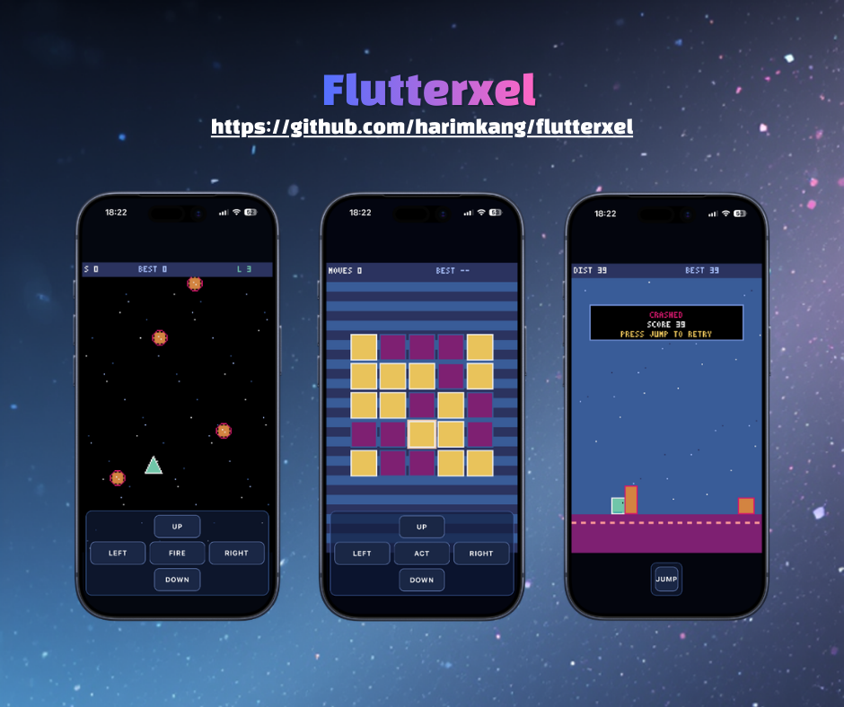

# flutterxel

`flutterxel` is a Pyxel-style retro game runtime for Flutter, powered by a Rust core over FFI.

It is built for developers who want fast pixel-game iteration with a familiar API (`init`, `run`, `cls`, `pset`, `text`, `btn`, `play`, and more) inside modern Flutter apps.



## Links

- Package: https://pub.dev/packages/flutterxel
- Install page: https://pub.dev/packages/flutterxel/install
- Documentation: https://harimkang.github.io/flutterxel/
- Example games: https://github.com/harimkang/flutterxel/tree/main/examples
- Upstream inspiration: https://github.com/kitao/pyxel

## Why flutterxel

- Pyxel-compatible API surface with both camelCase and snake_case aliases.
- Rust-native runtime core for graphics/audio/resource handling.
- Flutter-first integration through `FlutterxelView`.
- Full-screen-friendly layout patterns (see `examples/`).
- Resource persistence support (`.pyxres`, palette load/save paths).
- Published on pub.dev and ready to use in app projects.

## Installation

Add `flutterxel` from pub.dev:

```yaml
dependencies:
  flutterxel: ^0.0.5
```

Then run:

```bash
flutter pub get
```

## Quick Usage

```dart
import 'package:flutter/material.dart';
import 'package:flutterxel/flutterxel.dart' as flutterxel;

void main() => runApp(const MyApp());

class MyApp extends StatelessWidget {
  const MyApp({super.key});

  @override
  Widget build(BuildContext context) {
    return const MaterialApp(
      debugShowCheckedModeBanner: false,
      home: GamePage(),
    );
  }
}

class GamePage extends StatefulWidget {
  const GamePage({super.key});

  @override
  State<GamePage> createState() => _GamePageState();
}

class _GamePageState extends State<GamePage> {
  int playerX = 10;

  @override
  void initState() {
    super.initState();
    flutterxel.init(160, 120, title: 'My flutterxel game', fps: 60);
    flutterxel.run(_update, _draw);
  }

  @override
  void dispose() {
    flutterxel.stopRunLoop();
    super.dispose();
  }

  void _update() {
    if (flutterxel.btn(flutterxel.KEY_LEFT)) {
      playerX -= 2;
    }
    if (flutterxel.btn(flutterxel.KEY_RIGHT)) {
      playerX += 2;
    }
    playerX = playerX.clamp(0, flutterxel.width - 12).toInt();
  }

  void _draw() {
    flutterxel.cls(flutterxel.COLOR_BLACK);
    flutterxel.rect(playerX, 56, 12, 12, flutterxel.COLOR_CYAN);
    flutterxel.text(4, 4, 'HELLO FLUTTERXEL', flutterxel.COLOR_WHITE);
  }

  @override
  Widget build(BuildContext context) {
    return Scaffold(
      body: LayoutBuilder(
        builder: (context, constraints) {
          final scaleByWidth = constraints.maxWidth / 160;
          final scaleByHeight = constraints.maxHeight / 120;
          final scale = (scaleByWidth < scaleByHeight)
              ? scaleByWidth
              : scaleByHeight;

          return ColoredBox(
            color: const Color(0xFF05070E),
            child: Center(
              child: flutterxel.FlutterxelView(
                pixelScale: scale.clamp(1.0, 12.0).toDouble(),
              ),
            ),
          );
        },
      ),
    );
  }
}
```

## Example Games

Complete, playable examples are included under `examples/`:

- `examples/star_patrol` (top-down shooter)
- `examples/pixel_puzzle` (puzzle)
- `examples/void_runner` (runner)
- `examples/cosmic_survivor` (survival shooter)

Run one:

```bash
cd examples/star_patrol
flutter run
```

## Documentation and API

- Main docs: https://harimkang.github.io/flutterxel/
- API reference: automatically generated from source during docs build/deploy.

## Compatibility Notes

- Global `blt(...)` currently supports image resource ids (`int`) and resource-backed `Image` handles only.
- For detached `Image(...)` / `Image.fromImage(...)` objects, use `image.blt(...)` instead of global `blt(...)`.
- Built-in `text(...)` rendering currently supports ASCII code points `32..127`; unsupported code points are skipped.
- In native-binding mode, resource image mutations (`images[n].pset/cls/set/load`) are synchronized to native core image banks and are reflected by subsequent global `blt(...)` rendering.

## Monorepo Structure

```text
flutterxel/
├── packages/flutterxel        # Flutter plugin package
├── packages/flutterxel_tools  # Release/build helper tooling
├── native/flutterxel_core     # Rust core runtime + C ABI
├── examples/                  # Playable example games
└── docs/                      # GitHub Pages documentation source
```

## Local Development

```bash
dart run melos bootstrap
dart run melos run analyze
dart run melos run test
```

Rust core:

```bash
cd native/flutterxel_core
cargo test
```

## Asset Preprocessing with pixel-snap

`pixel-snap` is provided by `flutterxel_tools` for converting external/AI-generated images into retro-style assets before runtime usage.

Prerequisite:

- Rust and Cargo must be installed.

Examples:

```bash
dart run flutterxel_tools:flutterxel_tools pixel-snap --input assets/raw/hero.png --output assets/pixel/hero.png
dart run flutterxel_tools:flutterxel_tools pixel-snap --input assets/raw/hero.png --output assets/pixel/hero.snapped.png --colors 16 --overwrite
```

Arguments:

- `--input` (required): source image path
- `--output` (required): output image path
- `--colors` (optional): palette color count
- `--overwrite` (optional): replace existing output file

Implementation detail: this command shells out to `packages/flutterxel_tools/tool/pixel_snap_image.sh`, which runs `reference/spritefusion-pixel-snapper`.

## License

MIT. See [LICENSE](LICENSE).

For upstream attribution used in Pyxel compatibility work, see [THIRD_PARTY_NOTICES.md](THIRD_PARTY_NOTICES.md).
